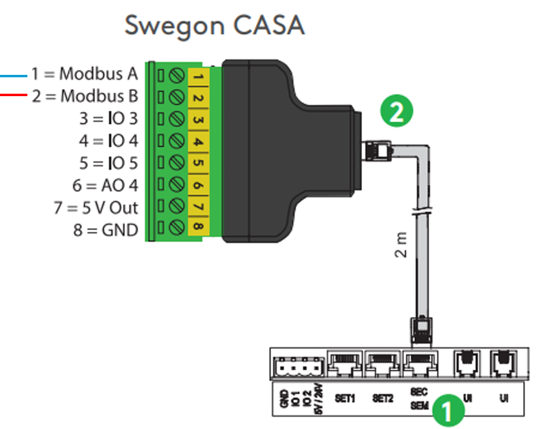
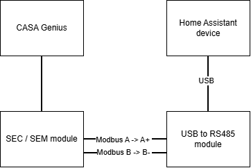

**Språk:** [English](README.md) | [Suomi](README.fi.md) | [Svenska](README.sv.md) | [Norsk](README.no.md)

# Swegon CASA Genius — Home Assistant-integrasjon

Home Assistant custom component for Swegon CASA Genius-ventilasjonsaggregatet.
Leser og styrer aggregatet via Modbus RTU (RS485). ~121 entiteter:
temperaturer, luftmengder, driftsmodus, alarmer, innstillinger.

> **Dette er en testversjon.** Installasjonen gjøres manuelt (ikke tilgjengelig via HACS ennå).

---

## Krav

Før du starter trenger du:

- Et **Swegon CASA Genius**-aggregat med styrekort **SCB 4.2** og programvare **SW 4.0 eller nyere**
  (testet på en W5 500W A-enhet, firmware 4.3.800)
- En **RS485-USB-adapter** koblet til aggregatets Modbus-buss og til Home Assistant-serveren
  (f.eks. en CH341-basert adapter, vises vanligvis som `/dev/ttyUSB0`)
- Home Assistant med tilgang til mappen `custom_components` (f.eks. via Studio Code Server,
  Samba eller File Editor)

Uten den fysiske enheten og en fungerende RS485-tilkobling kobler ikke integrasjonen til noe.

Alternative RS485-omformere:
- https://raspberrypi.dk/en/product/industrial-usb-to-rs485-bidirectional-converter/
- https://www.digikey.fi/en/products/detail/olimex-ltd/USB-RS485/21661988
- https://www.amazon.com/DSD-TECH-SH-U10-Converter-Compatible/dp/B078X5H8H7

---

## Tilkobling

CASA Genius-ventilasjonsaggregatet har et innebygd Modbus RTU-grensesnitt som hentes ut via en SEC- eller SEM-tilkoblingsmodul. Modulen kobles til kontakten "SEC/SEM" på aggregatets hovedkort med den medfølgende 2-meterskabelen.

To pinner på SEC/SEM-modulens koblingsplint brukes til Modbus-tilkoblingen: pinne 1 er Modbus A og pinne 2 er Modbus B. Disse kobles til en RS485-USB-omformer (f.eks. en Waveshare USB to RS485 (B)) slik at omformerens A+ kobles til Modbus A, og B- kobles til Modbus B. Bokstavmatchingen A↔A, B↔B er en vanlig konvensjon innen RS485, så dette er et trygt utgangspunkt — hvis tilkoblingen ikke fungerer med en gang, kan A- og B-lederne byttes om uten fare for skade.

RS485-USB-omformeren kobles til USB-porten på enheten som kjører Home Assistant, der den vanligvis vises som `/dev/ttyUSB0`. Dette samsvarer også med integrasjonens standardinnstilling for seriell port.

1. Ventilasjonsaggregatets tilkoblingspanel
2. Swegon SEC-tilkoblingsmodul





*Merk: en GND-tilkobling brukes ikke i denne koblingen. Hvis busstrekket blir lengre eller du opplever forstyrrelser, kan en felles jording mellom SEC/SEM-modulens pinne 8 og omformerens GND-kontakt forbedre påliteligheten.*

## Installasjon

1. Pakk ut pakken du fikk (`swegon_genius_jako.tar.gz`). Der finner du en mappe kalt `swegon_genius`.

2. Kopier hele mappen `swegon_genius` til Home Assistants mappe:

   ```
   /config/custom_components/swegon_genius/
   ```

   Hvis mappen `custom_components` ikke finnes, opprett den først.

   Hvis du pakker ut pakken direkte på serveren i en terminal:

   ```
   cd /config/custom_components
   tar -xzf /sti/swegon_genius_jako.tar.gz
   ```

3. Start Home Assistant på nytt:

   ```
   ha core restart
   ```

---

## Avinstallering

1. Fjern integrasjonen fra Home Assistant:
  - Åpne "Innstillinger → Enheter og tjenester"
  - Velg "Swegon CASA Genius"
  - Velg **Slett** (fra trepunktsmenyen)

2. Slett integrasjonens mappe:
   ```
   /config/custom_components/swegon_genius/
   ```

3. Start Home Assistant på nytt

Integrasjonen, dens entiteter og alle lagrede innstillinger fjernes.
> **Merk:** Dashbord, automatiseringer, skript, hjelpere og maler som refererer til integrasjonens entiteter **fjernes ikke automatisk**.
> Hvis de refererer til slettede entiteter, vil Home Assistant vise dem som *unavailable* til referansene fjernes eller oppdateres.

---

## Oppsett

1. **Innstillinger → Enheter og tjenester → Legg til integrasjon**
2. Søk etter **"Swegon CASA Genius"**
3. Angi tilkoblingsinnstillingene. Standardverdiene passer de fleste:

   | Innstilling | Standard | Merk |
   |--------|--------|------|
   | Seriell port | `/dev/ttyUSB0` | adapterens enhetssti |
   | Slaveadresse | `1` | aggregatets Modbus-adresse (1–247) |
   | Baudrate | `38400` | |
   | Stoppbits | `1` | |
   | Paritet | `N` | |

4. Lagre. Hvis tilkoblingen lykkes, vises entitetene under enheten.

---

## Hva pakken inneholder — og hva den IKKE gjør

**Inkludert:** selve integrasjonen (entiteter og styringer) samt oversettelser
for fem språk (fi/en/sv/nb/da).

**IKKE inkludert:**
- Dashbord-/grensesnittkort — bygg ditt eget, eller la være
- Virkningsgrad-mal (LTO %) — det er en egen definisjon i `configuration.yaml`
- PIN-beskyttelse for viftehastigheter — en dashbord-funksjon, ikke en del av integrasjonen

Du får altså bare entitetene. Å gjøre dem synlige på et dashbord er ditt eget arbeid.

---

## Entitetsnavn og språk

Entitetsnavn oversettes i henhold til **systemspråket**
(Innstillinger → Hjem-info → Språk), IKKE brukerprofilens språk. Slik fungerer
Home Assistant. Entitets-ID-er forblir de samme uavhengig av språk.

Merk: entitets-ID-er genereres fra navnet på din enhet, så de vil være
forskjellige fra andre brukeres. Et ferdig dashbord kan ikke kopieres direkte fra noen andre.

---

## Feilsøking

**"Tilkobling mislyktes — sjekk kabelen, slaveadressen og den serielle porten"**

- Sjekk adapteren? I en terminal: `ls -l /dev/ttyUSB*`
  Hvis ingenting vises, er adapteren ikke tilkoblet eller driveren ble ikke gjenkjent.
- Er den serielle porten riktig? På enkelte systemer er den `/dev/ttyUSB1` eller `/dev/ttyACM0`.
- Er slaveadressen riktig? Sjekk Modbus-innstillingene på aggregatets kontrollpanel.
- Er baudraten den samme som aggregatets? Standard er 38400, men den kan være 9600 eller 19200.
- Er bussens A/B riktig vei? Hvis du er usikker, prøv å bytte A↔B.

**Entiteter forblir "unavailable"**

- Sjekk at adapteren og kabelen forblir tilkoblet.
- Se på loggene: Innstillinger → System → Logger, søk etter "swegon".

---

## Tilbakemelding

Dette er en testversjon. Fortell meg hva som fungerer, hva som ikke gjør det, og hvilket
aggregat/firmware du testet med — det hjelper med ferdigstillelsen.
